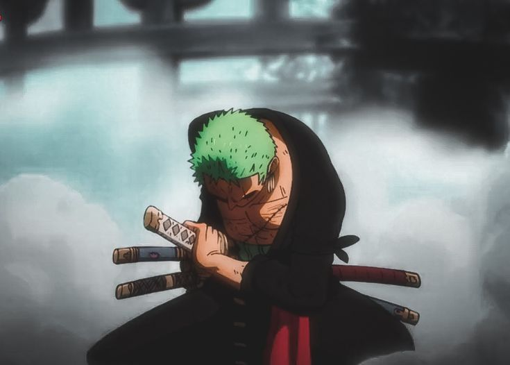

<div align="center">

```
███╗   ███╗███████╗██╗  ██╗███╗   ███╗ ██████╗
████╗ ████║██╔════╝██║  ██║████╗ ████║██╔═══██╗
██╔████╔██║█████╗  ███████║██╔████╔██║██║   ██║
██║╚██╔╝██║██╔══╝  ██╔══██║██║╚██╔╝██║██║   ██║
██║ ╚═╝ ██║███████╗██║  ██║██║ ╚═╝ ██║╚██████╔╝
╚═╝     ╚═╝╚══════╝╚═╝  ╚═╝╚═╝     ╚═╝ ╚═════╝
```


<br/>


</div>

---


### ✦ About Me

```yaml
name: "Mehmet — Momo"
role: "Developer · Builder · Vibe Coder"
status: "Building in public, one project at a time 🚀"
vibe: "Guided by my talented cousin, learning every day"
currently_coding_to: "Old-School Rap 🎧"
shipped: ["Esthetics by Mamii → mehmetmomo.netlify.app"]
portfolio: "mehmomomo.github.io"
```

<br clear="right"/>

---

### ⚡ Tech Arsenal

<div align="center">

**Frontend**


**Backend**


**Database & Tools**


</div>

---

### 🚀 Featured Projects

<div align="center">

| 🌐 Project | 📝 Description | 🔗 Links |
|---|---|---|
| **Esthetics by Mamii** | Live customer-facing website — clean, functional, real-world | [Live Demo](https://mehmetmomo.netlify.app) · [GitHub](https://github.com/mehmomomo/innospacex) |
| **Portfolio** | My personal dev portfolio — built to the beat 🎵 | [mehmomomo.github.io](https://mehmomomo.github.io) |

</div>

---

### 📊 GitHub Stats

<div align="center">
  
  
</div>

<div align="center">
  
</div>

---

### 🌸 Connect With Me

<div align="center">

[](https://twitter.com/mehmotme)
[](https://github.com/mehmomomo)
[](https://mehmomomo.github.io)

</div>

---

<div align="center">



*「 I will be the world's greatest swordsman 🗡️ 」*

</div>
